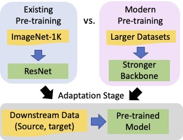

# [A Broad Study of Pre-training for Domain Generalization and Adaptation (ECCV 2022)](https://arxiv.org/pdf/2203.11819.pdf)
[Donghyun Kim](http://cs-people.bu.edu/donhk/), [Kaihong Wang](https://cs-people.bu.edu/kaiwkh/), [Stan Sclaroff](https://www.cs.bu.edu/fac/sclaroff/), and [Kate Saenko](http://ai.bu.edu/ksaenko.html).
#### [[Project Page]]()  [[Paper]](https://arxiv.org/pdf/2203.11819.pdf)



## Introduction

While domain transfer methods (e.g., domain adaptation, domain generalization) have been
proposed to learn transferable representations across domains, they are
typically applied to ResNet backbones pre-trained on ImageNet. Thus,
existing works pay little attention to the effects of pre-training on domain
transfer tasks. In this paper, we provide a broad study and in-depth analysis of pre-training for domain adaptation and generalization, namely:
network architectures, size, pre-training loss, and datasets. This repository contains PyTorch implementation of the single domain generalization experiments, which can be used as a baselin for domain transfer tasks including domain generalization and adpatation. This implementation is based on [Transfer Learning Library](https://github.com/thuml/Transfer-Learning-Library).

**Bibtex**
```
@InProceedings{kim2022unified,
  title={A Broad Study of Pre-training for Domain Generalization and Adaptation},
  author={Kim, Donghyun and Wang, Kaihong and Sclaroff, Stan and Saenko, Kate},
  booktitle = {The European Conference on Computer Vision (ECCV)},
  year = {2022} 
 }
```


# Usage

Our code is based on the implmentation of [Transfer Learning Library](https://github.com/thuml/Transfer-Learning-Library/tree/master/examples/domain_generalization/image_classification) and [timm](https://github.com/rwightman/pytorch-image-models/). Data will be downloaded automatically except WILD. WILD and timm can be installed using pip.
```
pip install wilds
```
```
pip install timm
```

# Baseline training example
### ConvNeXt
```
python main.py data_scc/office-home -d OfficeHome -s Rw -t Cl Ar Pr -a convnext_base_in22ft1k --seed 0 --log logs/baseline/

python main.py data_scc/domainnet -d DomainNet -s r -t i p q c s -a convnext_base_in22ft1k --seed 0 --log logs/baseline_domainnet/
```
### Swin Transformers
```
python main.py data_scc/office-home -d OfficeHome -s Rw -t Cl Ar Pr -a swin_base_patch4_window7_224 --seed 0 --log logs/baseline/

python main.py data_scc/domainnet -d DomainNet -s r -t c i p q s -a swin_base_patch4_window7_224 --seed 0 --log logs/baseline_domainnet/
```